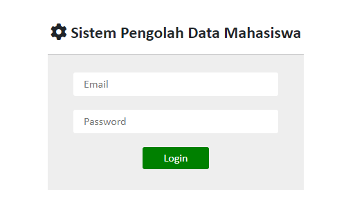
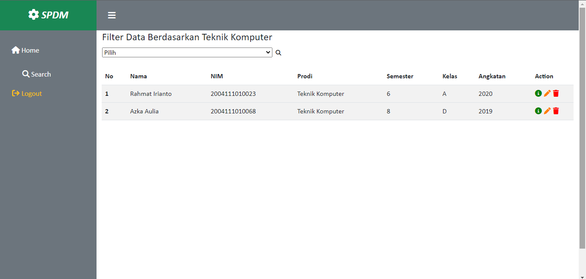

# spdm

Nama : Muhammad Haiqal

Prodi : Teknik Komputer

Universitas : Syiah Kuala

Asal : Langsa, Aceh

## Sistem Pengelola Data Mahasiswa (SPDM)
website yang dibuat sebagai sistem pengelola data mahasiswa 

```
akun admin
emain : admin@gmail.com
password : admin
```

fitur-fitur: 
- login admin



sebelum user menggunakan SPDM ini, user diwajibkan login terlebih dahulu


sistem akan memberi tanda jika akun yang user masukkan salah

- homepage


tampilan utama dari sistem

- cari dan filter data 



fitur cari dapat digunakan user untuk memudahkan mencari data mahasiswa dan fitur filter di halaman search berfungsi mengkelompokkan data

- lihat data


fitur detail berfungsi untuk menanpilkan seluruh informasi mahasiswa

- tambah data


fitur tambah berfungsi untuk menambahkan data mahasiswa 

- ubah data


fitur ubah berfungsi untuk mengubah data jika terjadi kesalahan input

- hapus data


fitur hapus berfungsi untuk menghapus data mahasiswa, sistem akan melakukan konfirmasi sebelum data dihapus

## Instalasi Sistem

1. Karena saya belum setting SSH jadi clone dapat dilakukan dengan mendownload langsung repositori ini
2. server yang digunakan iyalah XAMPP, nyalakan apache dan mysql
3. pada folder database, import database yang tersedia ke database MYSQL
4. buka aplikasi dengan mengetikkan di URL `Localhost/spdm`

